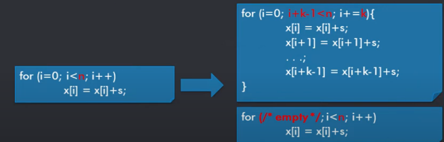

## Loop Unrolling
* Basically it is used to reduce the loop count inorder to improve the performance , but there would be some issues occurs here like loop count N can be unknown or no multiple of loop unrolling factor k
* So we need 2 loops
    1. One unrolled that iterates n div k times
    1. Copy of original that iterates n mod k times
* But the integer division and modulo operations are very expensive and they can avoided using trick

* With the Help of Register Renaming we can reduce the cycle count and latency
* Advantage: 
    1. Reduce Loop Overhead
    1. Imporve potential for instruction scheduling
* Disadvantage
    1. Increase code size
    1. Shortfall of register (Adhalaa register spilling paathukum)

## Branch Prediction
* Branch prediction is one of the most important techniques for improving performance in multi-cycle pipelined machines. 
* It have 2 methods
    1. Static Branch Prediction
    1. Dynamic Branch Prediction