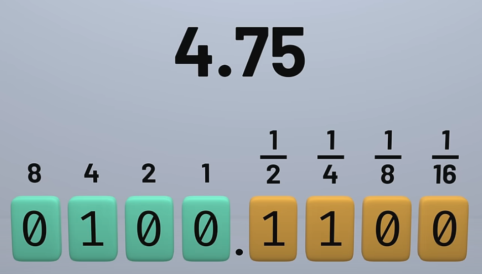
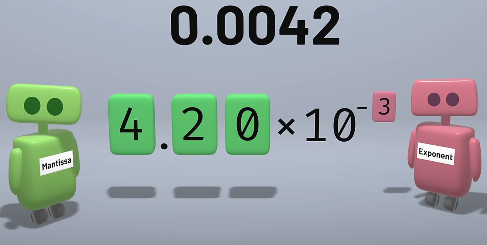
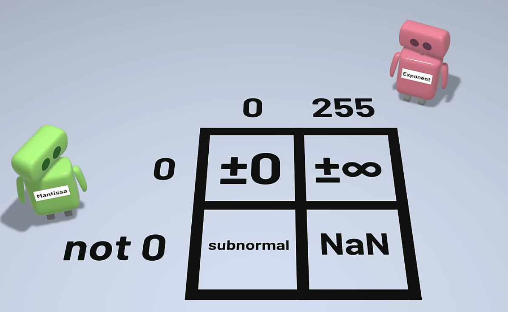
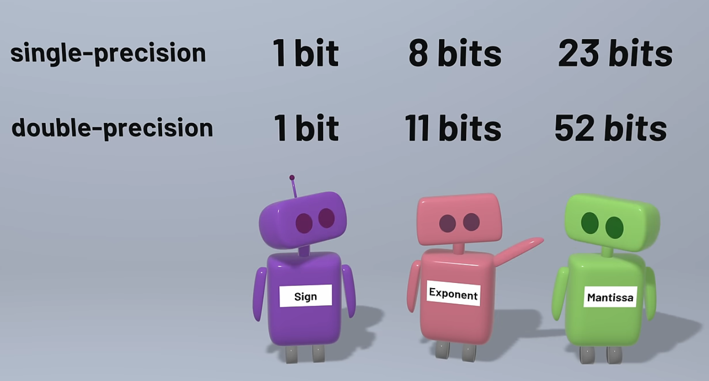

## Fixed and Floating point numbers
* Computer need to represent numbers that are not in integer

* But the above does not represent the 2.8 maybe it make closer (2.8125)
* And also we allocate place for fraction we reduced our dynamic range
* So to avoid this we have floating point
* Fixed point have 2 places (fraction and decimal) but floating point have (Mantissa and Exponent)

* The advantage is that it will give more range than the fixed point  but the precision will be very less
* So the floating point is standartised by the IEEE 754 . Which provide the differenct format for floating numbers
* The comman formats in IEEE 754 are Single precision and Double precision
* The single precision uses 32 bit to represent numbers and double precison use 64 bit to represent numbers
* Single precison = 1 -> Sign Bit , 8 -> Exponent (-127 - 128) , 23 -> Mantissa (every mantissa starts from 1 , so that is removed . All for the fractional part and it can have 24bit precision point (1(for every vaue so removed here) + 23fractional))
* we kno exponent represent -127 to 128 , The IEE standards takes the special cases for 2 very end (-127,128 or 0 and 255) so normal exponent represents -126 -> 127

* More exponent - More range and more smaller value
* More mantessa means more precision


## FIR program
* Resource : [link](https://sestevenson.wordpress.com/implementation-of-fir-filtering-in-c-part-1/)
* To run a pcm file : ffplay -f s16le -ar 44100 -ac 1 sound.pcm
* To convert wav file into pcm : ffmpeg -i mono_output.wav -f s16le -acodec pcm_s16le sound.pcm
* To get information of the wav signal : ffmpeg -i mono_output.wav
* To Convert Stereo to Mono : ffmpeg -i stereo_input.wav -ac 1 mono_output.wav
    - -ac 1 = set number of audio channels to 1 (mono)
```c
#include <stdio.h>
#include <string.h>  

#define MAX_INPUT_LEN 10
#define MAX_FLT_LEN   3
#define BUFFER_LEN (MAX_FLT_LEN - 1 + MAX_INPUT_LEN)

int insamp[BUFFER_LEN];

void firInt(int *coeffs, int *input, int *output, int length, int filterLength) {
    int acc;
    int *coeffp;
    int *inputp;
    int n, k;
    memcpy(&insamp[filterLength - 1], input, length * sizeof(int));
    for (n = 0; n < length; n++) {
        coeffp = coeffs;
        inputp = &insamp[filterLength - 1 + n];
        acc = 0;
        for (k = 0; k < filterLength; k++) {
            int a = (*coeffp++);
            int b = (*inputp--);
            printf("a = %d b = %d\n",a,b);
            acc +=  a*b; 
            printf("Acc : %d\n",acc);
        }
        printf("\n");
        output[n] = acc;
    }
    memmove(&insamp[0], &insamp[length], (filterLength - 1) * sizeof(int));
}
int main() {
    int input[] = {1, 2, 3, 4, 5, 6, 7, 8};
    int length = sizeof(input) / sizeof(int);
    int output[length];
    int coeffs[] = {1, 2, 3};  
    int filterLength = sizeof(coeffs) / sizeof(int);
    // firFloatInit();
    firInt(coeffs, input, output, length, filterLength);
    printf("Filtered Output:\n");
    for (int i = 0; i < length; i++) {
        printf("%d ", output[i]);
    }
    printf("\n");
    return 0;
}
```

## FIR ins SIMD
* To implement the FIR filter , first they invert the impulse response coefficient and name them as c
* They also padding it with the N-1 Zeros (N = filter length)
* Loop vectorization
    * Outer Loop Vectorization
    * Inner Loop Vectorization
    * Outer Inner Loop Vectorization
