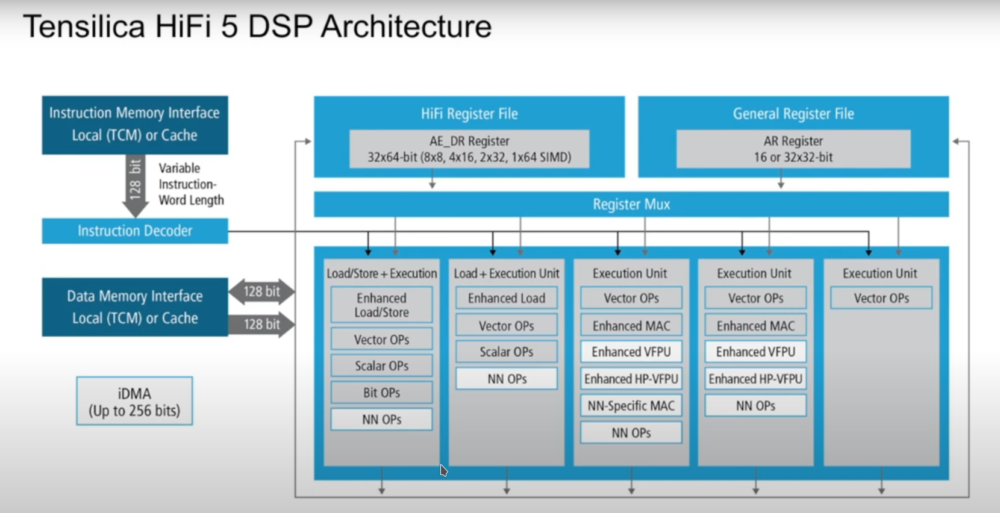

## Basic Concepts
* Aligned and Unaligned Memoru : [link](./aligned_vs_unaligned.md)
* Loop Unrolling : [link](./loop_unrolling.md)
* Fixed ad FloatingPoint Numbers : [link](./Example_Program/FIR_Filters.md)
## HiFi 5 vs HiFi 4

## Book
* It is designed for voice processiing and also used for doing the implementations of Neural Network apporach
* It is 5 VLIW slot which can do eight 32x32 MAC , sixteen 16x32 MAC and sixteen 16x16 MAC per cycle
* It have 2 128 bit load per cycle or we can do one for load and another for store
* It has additional floating point precision support  
* To support Neural network support , we have extension that do thirty two 8x16,4x16,8x8 MAC per cycle
* Multiplication supports both signed and unsigned
*  Some speech neural network implementations also use half-precision floating-point variables. For such networks, the HiFi 5 DSP includes a Half Precision floating point unit (HP FPU) option that provides up to sixteen half-precision IEEE-754 floating-point MACs per cycle.
## Overview 
* Base processor architecture = Xtensa LX7
* Tell about Pipelines - 5 stage and 7 stage
* Execute up to eight 32x32-bit MACs (Multiply-Accumulate operations).
* Execute up to sixteen 32x16-bit MACs and sixteen 16x16-bit MACs per cycle, significantly increasing throughput for audio and voice processing tasks.                                                                                                                                                                                                                                                                                                               
* The HiFi 5 DSP architecture has introduced a set of new FLIX formats as part of the RI-2022.9 Xtensa release. These formats are designed to enhance code size and improve performance for various applications, particularly in neural networks (NN) and digital signal processing (DSP) tasks.
* Audio software libraries supplied by Cadence do not use DMA. Hence, most customers either use caches or make local memories sufficiently large to cover desired applications.
* P , Q audio in mini
* Vector loads and stores, content at the high address in memory is always stored in the leastsignificant bits in the register. 
* HiFi 5 DSP also supports three circular buffers that can be used with either aligned or unaligned data.
* Like you said before HifI4 have 4 , Hifi 
* Data Types
    * Scalars, Vectors, and Dual Vectors
    * Element sizes: 8, 16, 24, 32, 64 bits
* When we store the value form memory to the register , the data with high memory address will store in LSB and when we have negative stride the value in least memory will be stored in LSB
* We we do load and store the data cache and internal memory have atleast 2 memory banks . when 2 or more memory access try to reach a same bank the performance will be slower
* Processing stall - the process neeed to
* It have 3 circular buffers
* The compiler also tries to arrange memory accesses smartly to minimize conflicts 
* Connection Box
* AE_LA64.PP - Used to load the data in a aligned way
* If there’s no banking and no connection box,  and you want to do dual loads or stores, the system needs dual-ported memory.
* AE_LA32X2_IP - Load 2 values in forward direction
* AE_LA32X2_RIP - Load 2 values in revere direction 
* AE_S32X2_IP / RIP - Store
## Architecture
* It is a SIMD which can have 5 VLIW and do eight 16 bit data at one cycle . 
* It is a VLIW architecture,supporting the execution of up to five operations in parallel.
* It have thirty two 64bit AE_DR and sixteen AR registers
* AE DR have either
    * two 32bit operands
    * four 16bit operands
    * eight 8bit operands
* The operands perform as integer, fixed point and floating point
* AR registers have short and integer values or they have pointers , offset and shift values
* Slot 0 : 
    * It do the operation include scalar , vector and scalar load and store 
    * Bitstream and huffamn 
    * Few ALU , shift , select operations
* Slot 1 : 
    * It is like slot 0 but doesnot have the scalar store
* Slot 2 and 3
    * Contains vector MAC and ALU
    * It contains optional floating point operations
    * Slot 2 have special operation that is used in NN
* Slot 4
    * It contains some limited set of operation that can be use in some scenerois like FFT processing
* Hi-Fi DSP uses little endian bit ordering for loading and storing values

* The formats that are encoded in 128 bit is supported by 5 slots but the 64-bit slots are supported in 3-2 slots 

## Programming the DSP
* HiFi 5 DSP offers eight 32-bit MACs per cycle or sixteen 16-bit MACs per cycle . 
*  With the optional Neural Network Extension, HiFi 5 also offers 8x16-bit and 8-bit support with 32 MACs per cycle.
* Fractional and integer types use different instructions for operator overloading.
* Fractional types use fractional multiplies and saturating arithmetic, while integer types use integer multiplies and non-saturating arithmetic.
* 24-bit integer types are stored in the low 24 bits of a 32-bit word.
* 24-bit fractional types are stored in the high 24 bits of a 32-bit word, with lower bits set to 0.
* All types, except for 56- and 64-bit types, come in both scalar and vector versions.
* Vector computation is done on vector variables, and scalar variables are replicated into every element of the vector.
* Assigning a vector to a scalar replicates the lowest element into the scalar, while assigning a scalar to a vector replicates the scalar into all vector elements.
* 64-bit data types must be aligned to 64 bits, and custom data types are automatically aligned.
* Standard C data types must be aligned by the user, especially when using dual vector load/store operations.
* 128-bit and 64-bit data types need 128-bit alignment for dual vector load/store operations.
* Low precision to high precision assignment sign-extends for signed types and zero-extends for unsigned types.
* High precision to low precision assignment discards the upper bits for integer types and the lower bits for fractional types.
* With optional floating point support, xtfloatx2 supports 2-way SIMD single precision floating point.
* xtfloatx2 can be converted to and from ae_int32x2 using standard integer-to-floating point conversions.
* xtfloatx4 is used for dual vector load/store operations and handles arithmetic and multiply operations.
* xtcomplexfloatx2 enables arithmetic and multiply operations on complex float data types.
* Scalar variables can be assigned to intrinsics expecting vector arguments without changing their bit pattern.
Legacy HiFi 2 types are supported for compatibility but should be used only for HiFi 2 code.
* Vector types assigned to ae_p24s or ae_p24f do not replicate elements in HiFi 2 but retain the bit patterns.

