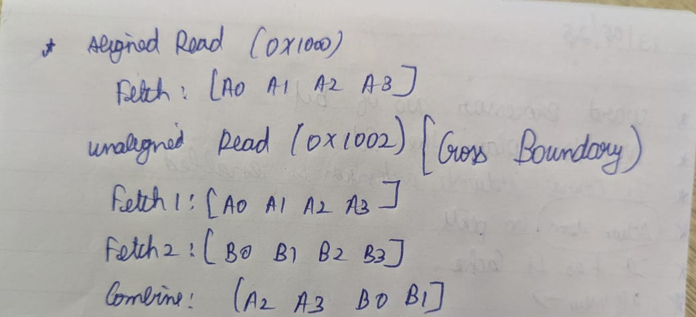
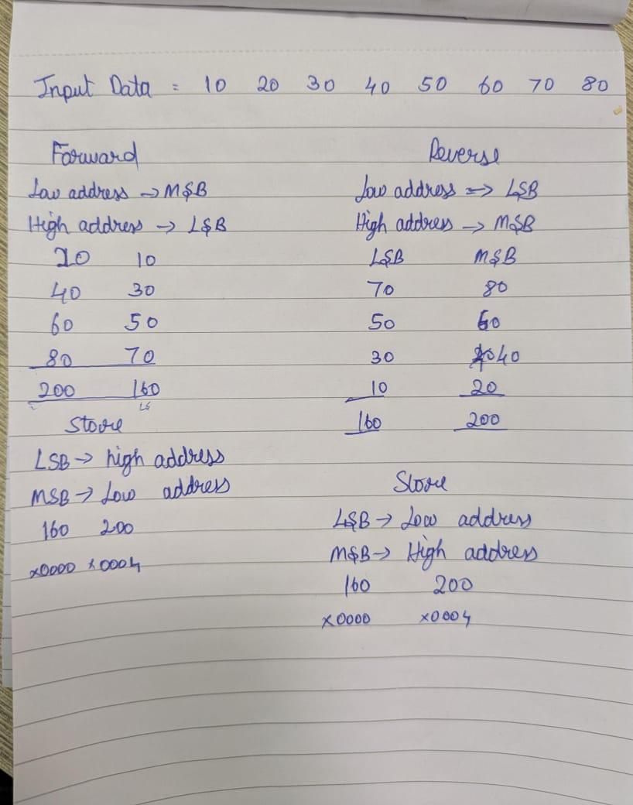

## Aligned vs Unaligned


```c
#include <stdio.h>
#include "xtensa/tie/xt_hifi5.h"
int low , high;
void add(int * a, int size, ae_int32x2 *vector)
{
	ae_int32x2 *ap=(ae_int32x2 *) &a[0];
	ae_int32x2 tmp;
	ae_valign align;
	align = AE_LA64_PP(ap); // prime the stream
	for(int times = 0; times < size/2; times++)
	{
		AE_LA32X2_IP(tmp,align,ap); // load the next element
		low = AE_MOVAD32_L(tmp);
		high = AE_MOVAD32_H(tmp);
		printf("Temp Normal : \n");
		printf("Low : %d High : %d\n",low,high);
		*vector = *vector + tmp;
		printf("Vector Normal : \n");
		low = AE_MOVAD32_L(*vector);
		high = AE_MOVAD32_H(*vector);
		printf("Low : %d High : %d\n",low,high);
	}
}
void add_negstride(int * a, int size, ae_int32x2 *vector)
{
	ae_int32x2 *ap=(ae_int32x2 *) &a[size-1];
	ae_int32x2 tmp;
	ae_valign align;
	align = AE_LA64_PP(ap); // prime the stream
	for(int times = 0; times < size/2; times++)
	{
		AE_LA32X2_RIP(tmp,align,ap); // load the next element
		high = AE_MOVAD32_H(tmp);
		low = AE_MOVAD32_L(tmp);
		printf("Temp : \n");
		printf("Low : %d High : %d\n",low,high);
		*vector = *vector + tmp;
		printf("Vector : \n");
		high = AE_MOVAD32_H(*vector);
		low = AE_MOVAD32_L(*vector);
		printf("Low : %d High : %d\n",low,high);
	}
}
int main() {
	int size = 8;
    int input_data[8] = {10, 20, 30, 40, 50, 60, 70, 80};
    int result_normal[2],result_negstride[2];
    ae_int32x2 vector = (ae_int32x2)(0);
    add(input_data, size, &vector);
    ae_int32 *result_normal_pointer = (ae_int32 *)result_normal;
    AE_S32X2_I(vector, result_normal_pointer, 0);
    printf("Positive Stride Add : \n");
    printf("Result[0] :  %d Result[1] : %d\n\n", result_normal[0],result_normal[1]);
    vector = (ae_int32x2)(0);
    add_negstride(input_data,size, &vector);
    ae_int32 *result_negstride_pointer = (ae_int32 *)result_negstride;
    AE_S32X2_RI(vector, result_negstride_pointer, 0);
    printf("\nNegative Stride Add : \n");
    printf("Result[0] :  %d Result[1] : %d\n", result_negstride[0],result_negstride[1]);
    return 0;
}
```

