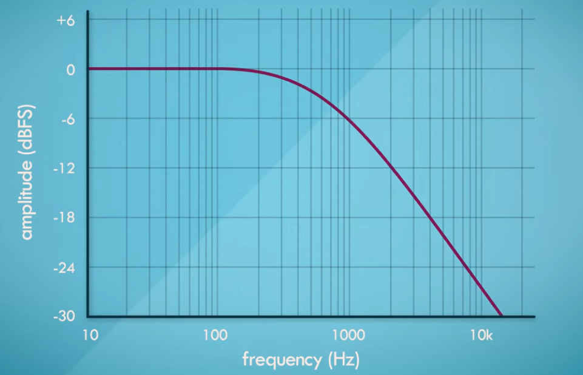

## Digital Filter Basics
* A filter is any medium through which a signal propogates , which modifies the signal
* Digital filters : Takes sequence of input and give new sequence of value as output signal. 
* The amplitude of the signal are modified by the filters
* To visualize the frequency changes that are done by filter , we need to see the frequency response graph
